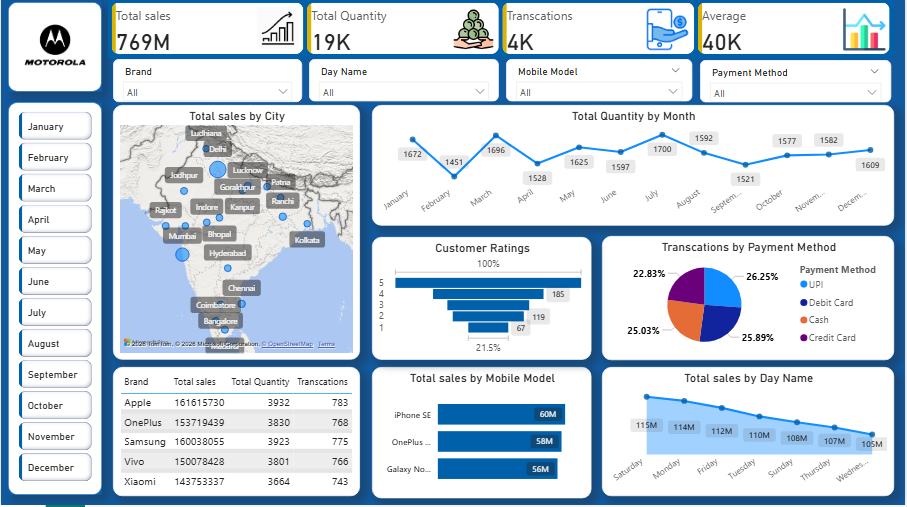

# Mobile Sales Analytics Dashboard

An interactive **Power BI** dashboard analyzing mobile sales performance across brands, top mobile models, payment methods, transaction volumes, and geographic sales distribution.

---

## 📌 Project Overview

This analytics project delivers comprehensive sales performance metrics for mobile retail. It tracks key performance indicators (KPIs) such as revenue, order volume, transaction frequency, average transaction value, customer satisfaction ratings, and regional market penetration across Indian cities.

---

## 📊 Dashboard Preview



---

## 🛠️ Tools & Technologies Used

- **Power BI Desktop:** Data modeling, DAX aggregations, custom UI formatting, interactive visuals, and report filtering.
- **Data Source:** Mobile sales dataset (`sales_dataset.xlsx`).

---

## 📈 Key Metrics & Highlights

- **Total Sales Revenue:** ₹769M
- **Total Units Sold:** 19K Units
- **Total Transactions:** 4K Completed Orders
- **Average Transaction Value:** ₹40K per Order

---

## 🔍 Key Insights & Analysis

1. **Top Performing Models:** iPhone SE generated the highest revenue (60M), followed closely by OnePlus models (58M) and Samsung Galaxy series (56M).
2. **Payment Channel Breakdown:** Sales are well-balanced across channels—Debit Card (26.25%), Credit Card (25.89%), Cash (25.03%), and UPI (22.83%).
3. **Geographic Distribution:** Strong regional market presence spanning metro hubs including Delhi, Mumbai, Kolkata, Chennai, Hyderabad, Bangalore, Lucknow, Patna, and Ludhiana.
4. **Sales Dynamics:** Consistent transaction volumes across weekdays, with peak activity occurring on Saturdays.

---

## 📁 Repository Structure

```text
├── sales_dataset.xlsx          # Source dataset
├── Mobile Sales Dashboard.pbix # Power BI dashboard file
├── sales_dashboard.png        # Dashboard preview image
└── README.md                   # Project documentation
